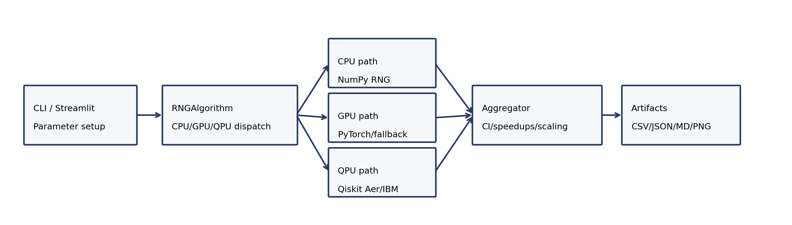
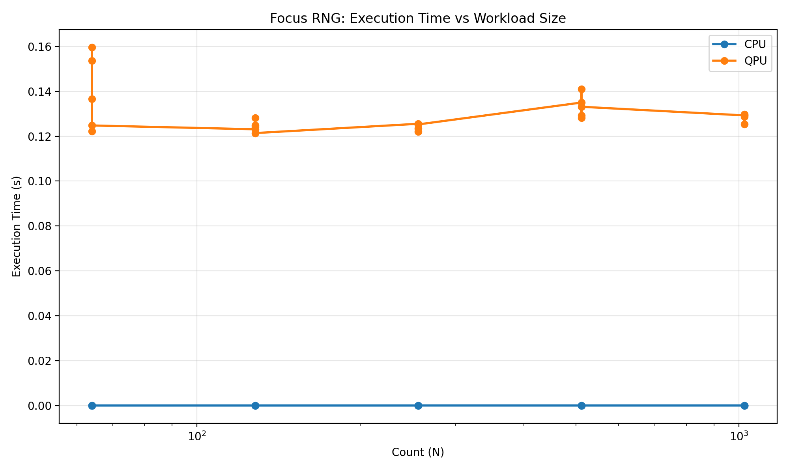
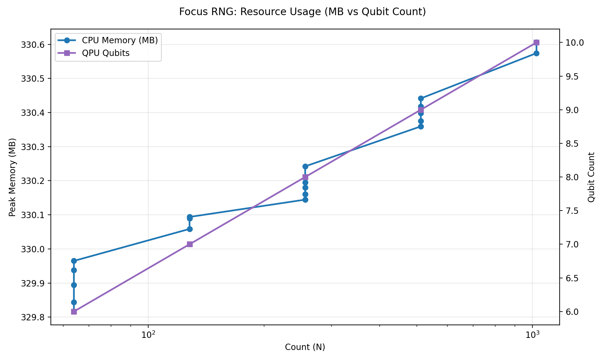
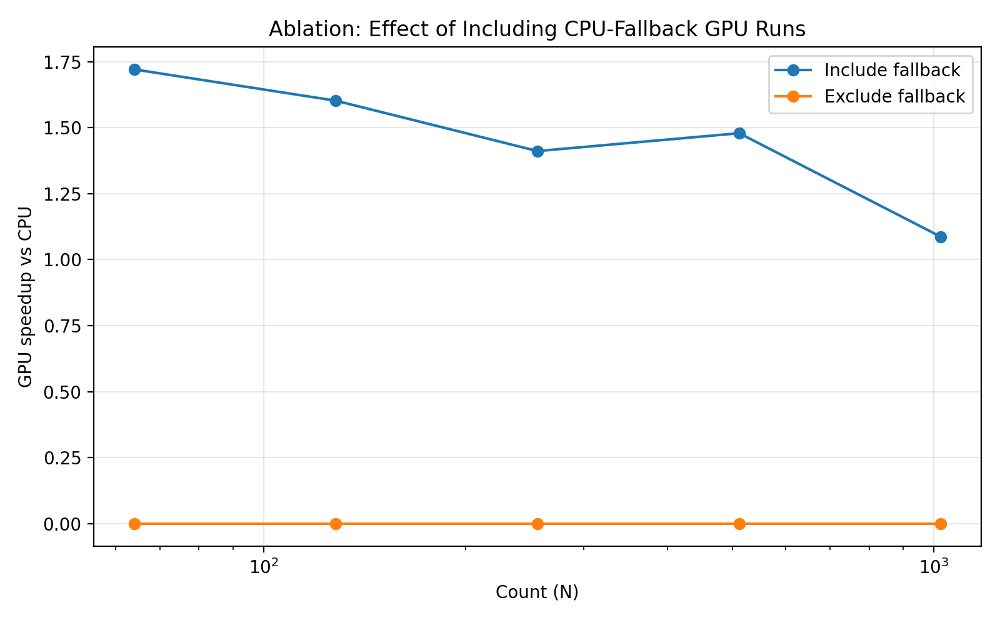
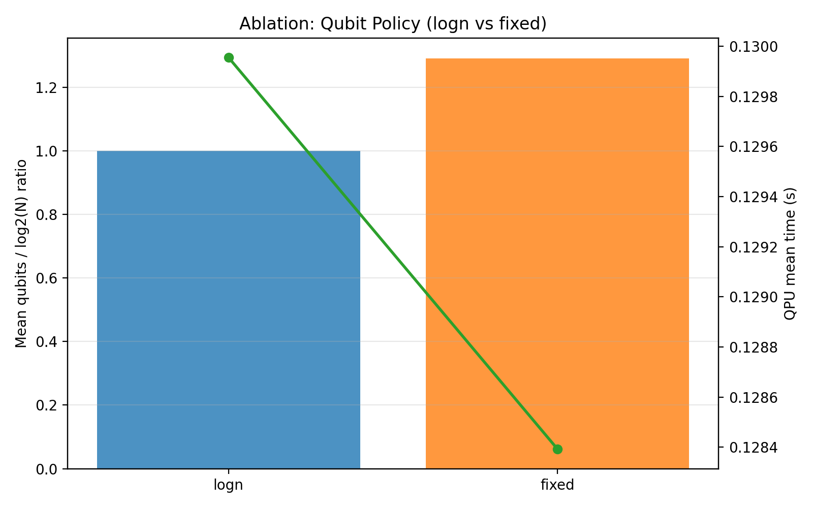

# Focus RNG: A Reproducible CPU/GPU/QPU Benchmarking Framework for Runtime-Resource Trade-off Analysis

## Abstract
This paper presents a repository-backed benchmarking framework for comparing random number generation (RNG) workloads across CPU, GPU, and QPU backends. The implementation unifies execution paths in a single interface, adds explicit backend provenance (`backend_type`, fallback flags), and exports reproducible artifacts (JSON/CSV/Markdown/figures). The main experiment (`results/reports/paper_main`) uses warmup runs and repeated trials with 95% confidence intervals over workload sizes `N={64,128,256,512,1024}`. In the current environment, CUDA is unavailable, so all GPU runs execute in CPU fallback mode and are excluded from primary analysis. Under this constraint, CPU mean time is `3.97e-05 s` while QPU-simulator mean time is `0.129955 s`, with QPU/CPU speedup values in `2.77e-4` to `3.34e-4` (that is, QPU-simulator is approximately 3 orders of magnitude slower here). Ablations show that including fallback rows can create misleading GPU speedup claims (`1.09x` to `1.72x`). The paper package includes traceability, reproducibility checklists, and artifact evaluation instructions. Real QPU-hardware advantage and true GPU acceleration are **not supported by current repository evidence**.

## 1. Introduction
Cross-architecture benchmarking is increasingly discussed in hybrid computing contexts, but reproducible evaluations often fail to distinguish between true hardware execution and fallback execution paths. This repository targets a focused question: how execution time and architecture-specific resource proxies evolve for RNG tasks across CPU, GPU, and QPU backends.

The repository contribution is practical rather than theoretical novelty: it operationalizes a benchmarking pipeline with explicit provenance and failure reporting. This paper documents that pipeline in a publication-style format and evaluates what can and cannot be claimed from current evidence.

### 1.1 Problem Statement
Given workload size `N`, compare RNG execution behavior across:
- CPU sequential pseudo-RNG,
- GPU parallel pseudo-RNG,
- QPU quantum RNG,
with respect to runtime and resource indicators.

### 1.2 Contributions (Evidence-Backed)
1. Unified multi-backend execution interface in `algorithms/rng_algorithm.py`.
2. Repeated-trial benchmark protocol with warmup and confidence intervals in `focus_rng_benchmark.py`.
3. Explicit fallback and backend-type annotation to prevent misinterpretation.
4. Reproducible report artifacts and figures under `results/reports/*`.
5. Publication package under `paper/` including traceability and reproducibility documentation.

## 2. Related Work
CPU/GPU pseudo-random generation benchmarking has prior coverage in applied literature [@askar2021gpu]. QRNG workflows on cloud superconducting platforms have also been explored [@li2021cloudqrng], and certified quantum randomness has been reported at larger hardware scales [@nature2025certified].

This repository differs by emphasizing an engineering pipeline that:
- unifies CPU/GPU/QPU execution contracts,
- records backend provenance per run,
- and treats fallback execution as a first-class methodological confound.

## 3. Methodology

## 3.1 Task Definition
For each workload size `N`, generate `N` integer samples in the range `[0, 2^q - 1]`, where `q` is either fixed or derived from `ceil(log2(N))`.

## 3.2 Complexity Framing
The repository uses an expected-complexity framing:
- CPU path: `O(N)`
- GPU path: approximately `O(N/P)` with effective parallelism `P`
- QPU resource width in `logn` mode: `q \approx ceil(log2(N))`

These are interpretive targets rather than formally proven bounds in this codebase.

## 3.3 Statistical Treatment
For each platform and workload, measured runs are repeated (`--repeats`) after warmup (`--warmup`). The summary reports:
- mean, median, standard deviation,
- 95% CI using normal approximation:

$$
\mathrm{CI}_{95\%} = \bar{x} \pm 1.96 \frac{s}{\sqrt{n}}
$$

Speedup is computed from mean timings:

$$
\mathrm{Speedup}_{A \to B}(N) = \frac{T_A(N)}{T_B(N)}
$$

Where sample sizes permit, Welch's two-sample t-test is computed for pairwise timing comparisons (`paper/tables/table_significance_welch_ttest.csv`).

## 3.4 Fallback-Filtering Rule
A run is excluded from primary analysis if `is_fallback=true` and `--include-fallback` is not set. This is implemented in `analysis_rows(...)` in `focus_rng_benchmark.py`.

## 4. System Architecture and Implementation
Figure 1 shows the end-to-end flow from CLI/UI configuration through backend dispatch and artifact generation.



### 4.1 Key Modules
- `app.py`: interactive Streamlit dashboard [@streamlit_docs].
- `focus_rng_benchmark.py`: batch benchmark and report writer.
- `algorithms/rng_algorithm.py`: CPU/GPU/QPU wrapper.
- `quantum/quantum_rng.py`: Qiskit circuit construction and execution [@qiskit_docs; @qiskit_aer_docs].
- `utils/helpers.py`: seed setting and hardware detection.

### 4.2 Algorithmic Procedure (Pseudocode)
```text
Algorithm 1: Repeated Cross-Platform RNG Benchmark
Input: counts, qubit_policy, shots, warmup, repeats, include_fallback
for each count in counts:
    q <- resolve_qubits(count, qubit_policy)
    run warmup times: execute CPU/GPU/QPU (discard)
    for trial in 1..repeats:
        result <- run_comparison(count, q, shots)
        flatten per-platform row with backend_type and is_fallback
filter rows if include_fallback = false
compute per-platform mean/std/CI and speedups vs CPU
write raw_runs.json, results.csv, summary.json, report.md, plots
```

## 5. Experimental Setup

## 5.1 Environment Snapshot
Captured in `paper/tables/table_environment_snapshot.csv`.
- Python: 3.13.11
- OS: Linux (Arch)
- CPU: 8 logical threads / 4 physical cores
- `torch.cuda.is_available() = False`
- QPU backend in runs: `aer_simulator`

## 5.2 Workload and Protocol
Primary experiment (`paper_main`):
- counts: `64,128,256,512,1024`
- qubit mode: `logn`
- shots: `1024`
- warmup: `2`
- repeats: `5`
- include fallback: `False`

Ablations:
- `paper_ablation_include_fallback`: same setup, include fallback rows.
- `paper_ablation_fixedq`: fixed qubits (`q=10`), fallback excluded.

## 5.3 Dataset
No external dataset is used. Inputs are synthetic workload sizes and algorithmically generated random values.

## 6. Metrics
Primary metrics:
- execution time (`execution_time_s`)
- throughput (`throughput_numbers_per_s`)
- peak memory (`peak_memory_mb`) for CPU/GPU process context
- QPU qubit count (`qpu_qubits`)
- empirical log-log time exponent

Important caveat:
- MB and qubits are architecture-specific proxies, not commensurate physical units.

## 7. Results

## 7.1 Primary Results (`paper_main`)
Main summary table source: `paper/tables/table_main_platform_summary.csv`.

- CPU analyzed runs: 25/25, mean time `3.97e-05 s`, CI `[3.71e-05, 4.23e-05]`.
- GPU analyzed runs: 0/25 because all 25 runs were CPU fallback and excluded.
- QPU analyzed runs: 25/25 (simulator), mean time `0.129955 s`, CI `[0.126285, 0.133625]`.

This implies QPU-simulator runtime is much slower than CPU in this environment. QPU/CPU speedup values (Table `table_main_speedup_vs_cpu.csv`) are approximately `2.77e-4` to `3.34e-4`, corresponding to roughly `3.0e3` to `3.6e3` slower runtime than CPU.

Welch t-tests in `paper/tables/table_significance_welch_ttest.csv` report `p < 5e-5` for CPU-vs-QPU timing comparisons at all tested counts in the primary run.

### 7.1.1 Runtime Scaling Figure


### 7.1.2 Resource Figure


## 7.2 Interpretation Boundary
The repository can support a conservative claim that, under CPU-only classical execution and QPU simulation, the simulator path is slower for tested `N`.

The repository cannot support a claim of real hardware quantum advantage for this setup.

## 8. Ablations and Error Analysis

## 8.1 Ablation A: Including Fallback Rows
Table source: `paper/tables/table_ablation_fallback_speedup.csv`.

When fallback rows are included, GPU appears faster than CPU (`1.09x` to `1.72x` depending on `N`). However, these are CPU-executed fallback runs labeled under GPU platform metadata. This demonstrates a methodological pitfall: fallback inclusion can inflate claims about GPU acceleration.



## 8.2 Ablation B: Qubit Policy (`logn` vs `fixed`)
Table source: `paper/tables/table_ablation_qubit_mode.csv`.

- `logn` mode: mean qubits/log2(N) ratio = `1.0`.
- `fixed` mode: mean qubits/log2(N) ratio = `1.291`.

QPU mean runtime remained similar across these two tested policies in this simulator setting (about `0.128` to `0.130 s`), suggesting limited sensitivity in this narrow regime.



## 8.3 Negative Result: Dependency Failure Run
Historical run (`results/reports/focus_rng_20260324_024923`) shows `QPU` failures with `No module named 'qiskit'`, and zero QPU successful runs. This is included to document failure behavior and environmental fragility rather than to support performance claims.

Table source: `paper/tables/table_legacy_failure_summary.csv`.

## 9. Limitations, Ethics, and Risks

## 9.1 Technical Limitations
1. True CUDA GPU path is absent in current environment.
2. QPU execution is simulator-only.
3. Randomness-quality testing is limited to simple descriptive statistics.
4. Memory metric semantics differ from qubit count semantics.
5. Timing precision is very fine-grained and may be noisy for tiny CPU workloads.

## 9.2 Scope-Limit Statements
- Real GPU acceleration over CPU: **Not supported by current repository evidence**.
- Real QPU hardware advantage: **Not supported by current repository evidence**.
- Cryptographic-strength randomness certification for outputs: **Not supported by current repository evidence**.

## 9.3 Ethical and Practical Risks
Misreporting fallback runs as hardware-backed acceleration can mislead resource planning and research conclusions. The repository now mitigates this by explicit fallback tagging and filtering.

## 10. Reproducibility

## 10.1 Determinism Controls
Seeds are set via `set_seed(...)` for Python, NumPy, and torch paths.

## 10.2 Main Reproduction Command
```bash
MPLCONFIGDIR=/tmp/mpl .venv/bin/python focus_rng_benchmark.py \
  --counts 64,128,256,512,1024 \
  --qubit-mode logn \
  --shots 1024 \
  --warmup 2 \
  --repeats 5 \
  --output-dir results/reports/paper_main
```

## 10.3 Traceability
The complete file-to-section mapping is provided in `paper/traceability-matrix.md`.

## 11. Conclusion and Future Work
This repository provides a useful reproducible framework for architecture-aware RNG benchmarking and artifact generation. In the present environment, the strongest defensible conclusion is methodological: explicit fallback handling materially changes interpretation. Performance conclusions remain environment-bounded: CPU and QPU-simulator were measurable, while true CUDA-GPU and real QPU hardware evidence are absent.

Future work required for stronger publication claims:
1. Run on CUDA-capable hardware with non-fallback GPU rows.
2. Run on real quantum hardware and report queue/execution split.
3. Add formal randomness test suites (for example, NIST-style batteries).
4. Add hypothesis testing beyond descriptive CIs.

## Acknowledged Evidence Gaps
- No external dataset benchmark suite.
- No power/energy measurement in current pipeline.
- Legacy search artifacts are retained but out-of-scope.

## References
Bibliography file: `paper/references.bib`.
